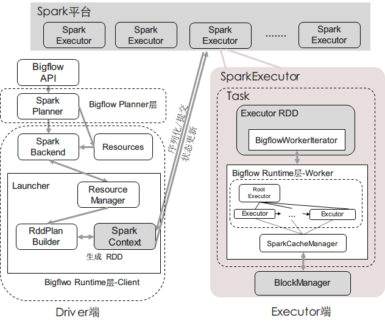

############
整体架构
############

从流程上讲：
(Client端)：用户使用Bigflow API写出的代码经由Core API转换为逻辑计划后，通过SparkPlanner翻译为物理计划，
再由一个维护SparkContext和任务执行情况的后台Launcher从物理计划构建出Spark RDD DAG图，然后提交给Spark平台

(Worker端): 当某一个RDD的分片在Spark平台的某一个Executor进程中，调用compute()进行执行时，Bigflow Worker会
构造出一棵执行树，与Spark RDD进行交互，驱动数据的计算过程

整个过程如下图所示

每个Spark RDD内部分装一个Bigflow Task，并在Task内部构建Executor Tree
