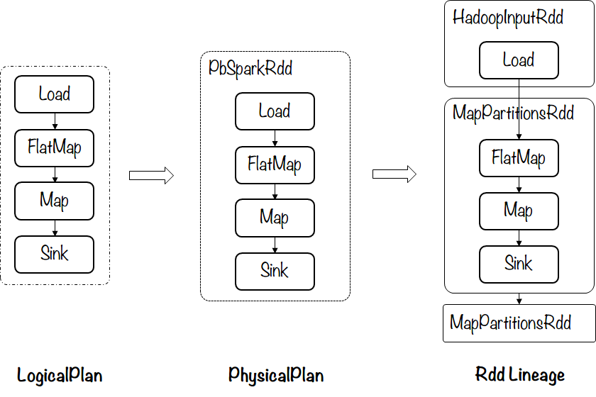
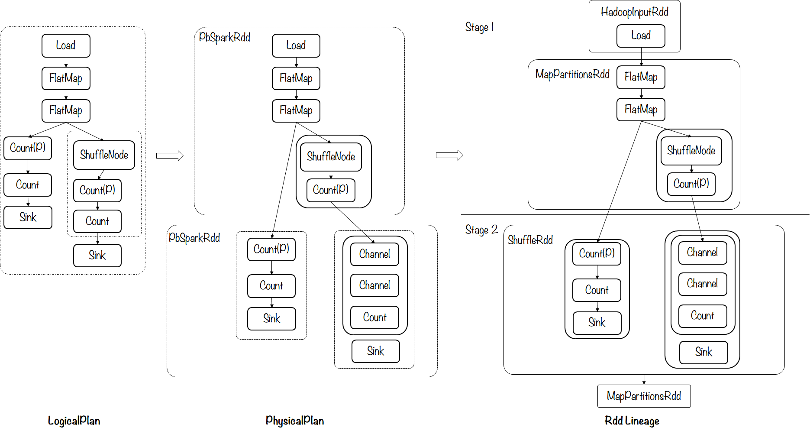

##############
示例
##############

示例1 – 单Stage('map-only')作业
==============================

.. code-block:: python

    from bigflow import base
    def foo(line):
        return "".join(set(line))
    p = base.Pipeline.create('spark', spark_conf=configs, runtime="JNI")
    ret = p \
        .read(input.TextFile('/test.in')) \
        .map(foo)
    p.write(ret, output.TextFile('/test.out'))
    p.run()

生成的计划示意图如下：

示例2 – WordCount
==============================

.. code-block:: python

    words = p \
        .read(input.TextFile("/home/wangcong09/modif.small")) \
        .flat_map(lambda _: _.split())
    cnt1 = words \
        .apply(transforms.count)
    cnt2 = words \
        .group_by(lambda _: _) \
        .apply_values(transforms.count) \
        .flatten()
    p.write(cnt1, output.TextFile('/test.out1'))
    p.write(cnt2, output.TextFile('/test.out2'))

生成的计划示意图如下：

