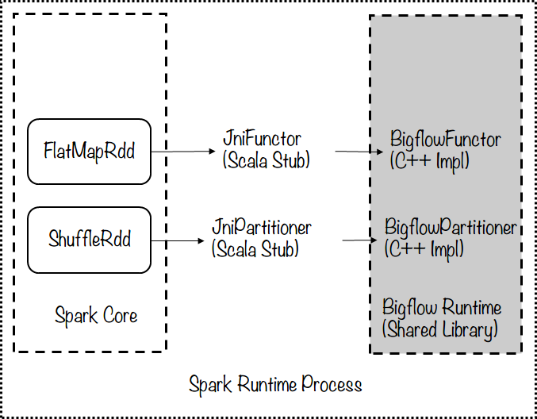
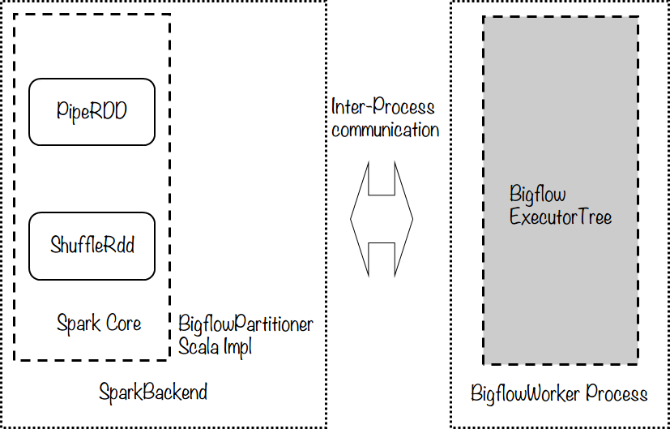

##############
设计思路及折衷
##############

需要利用Spark的哪些机制
==========================

作为所谓的“下一代数据处理引擎"，Spark与相对更早的Hadoop相比，主要有下面几个优点：

1. 高层抽象的API

2. 常驻内存的计算机制

3. 一站式的计算服务，对于离线、流式、机器学习等都有支持

对于1，Bigflow拥有层次更高、更加统一的抽象模型，比如可嵌套的抽象数据集等。对接的工作，就是
为了能够将Bigflow的抽象模型能够对接到Spark引擎上执行

对于3，Bigflow同样支持多种计算场景，只不过是通过对接多种计算引擎来实现

对于2，这里是Bigflow对接工作的“对接点”，也就是所要利用Spark引擎的地方。更详细地，Bigflow的作业
在分布式环境下执行时，应当能够享受到：

a. Spark的常驻式Executor以及基于线程的细调度调度模式，使得任务分片的调度代价更小、速度更快

b. Spark Cache机制对于迭代式计算的良好支持，Bigflow的Cache与Spark拥有非常相似的语义，应当能够充分利用Spark Cache

c. 基于Lineage的fail-over机制

此外，对于相对较小规模的计算任务，Spark可以使用Hash-Based Shuffle，在不需要排序的Shuffle场景中，
可以有更好的性能

数据计算方式
------------

对于Bigflow的某个Task而言，Spark RDD被看作是一个"壳"：RDD将输入数据通过Bigflow所实现的变换(例如
mapPartition方法的自定义函数)，将数据交给Bigflow Executor，然后Executor在内部完成所有所需要的计算，
再交还给Spark RDD。再使用RDD的repartition方法，通过Bigflow所实现的partition函数进行数据的分组/排序，
实现Bigflow所需要的Shuffle。Shuffle数据进入到下一个Stage的RDD中，重复计算过程

在这种方式下，相当于仅利用了Spark的Task调度以及Shuffle机制，此外，能够尽可能少地进行Bigflow与Spark之
间的数据交换，以减少数据的序列化/反序列化以及潜在需要的拷贝开销

.. code-block:: scala

    val bigflowDelgatingRDDResult = sparkContext \
        .mapPartitions(bigflowTaskFunction(task1)) \
        .repartition(bigflowPartitioner) \
        .mapPartitions(bigflowTaskFunction(task2)) \
        .repartitions(...)

Cache机制
------------

Bigflow应当能够将数据存储在Spark Cache中，由于Spark的Cache是以RDD为粒度，应当考虑使用更加底层的接口直
接与Spark的内存管理进行交互，而不是直接使用诸如RDD.cache()这样的接口

Spark RDD与Bigflow RuntimeWorker的交互方式
===========================================

Spark使用Scala编写，运行环境是JVM，而Bigflow RuntimeWorker主体使用C++编写，对于JVM而言属于Native。对
于Bigflow Python API，运行时还有CPython Interpreter(同样Native实现)。主要考虑两种实现方式：

* JNI：Bigflow runtime与Spark runtime通过Java Native Interface(简称JNI)进行数据交换。具体来说，Bigflow
  Runtime(worker)以一个so的方式被JVM加载，并通过Scala的native method方法进行调用。这种方式使得两种语言
  C++/Scala在进程内部进行通讯，在Spark的Executor执行方式下，这种方式相当于一个“多线程"模型，如下图所示：

* Pipe：Bigflow runtime与Spark runtime通过Pipe进行数据交换。具体来说，Bigflow Runtime(worker)以更加
  “常规”的方式，执行的入口是Backend::Execute()方法。这种方式使得两种语言C++/Scala进行进程间通讯，在
  Spark的Executor执行方式下，这种方式相当于一个“多进程”模型，如下图所示：

* JNI vs Pipe

  Pipe优于JNI之处：

  1. 相互隔离的环境

  2. 相对简单的实现

  3. 对于Bigflow Python API而言，由于CPython GIL的原因，只有多进程模型才能够充分利用CPU的多核。

  JNI优于Pipe之处：

  1. 更高的效率：共享内存，没有序列化开销

  2. 更加直接的交互方式

  3. 可以使用多Executor，每个Executor单线程的方式规避CPython GIL所导致的多线程性能问题

访问Peta等存储的方式
===========================================

Bigflow目前动态依赖了libhdfs.so，并使用了其内部的hdfs C API访问Peta。对于Baidu Spark而言，其访问的是
社区HDFS接口，与公司内部的Peta已经有很大的不同，为了能够做到适配，目前使用的是DS同学所提供的Peta-Agent
方案，即通过在机器上部署一个agent做社区接口访问Peta的适配。这样可能会带来两个问题：

1. Bigflow的用户如果需要使用对接Spark的功能，也需要在自己的环境部署Peta-Agent，否则会出现访问错误。不
过由于目前公司内部要使用Spark本身就需要Peta-Agent，这一点是可以接受的

2. Bigflow需要在client和运行端处理好内部Peta接口/社区接口的环境隔离，防止两种相似的接口及相应的依赖混
用导致出错。针对这一点，Bigflow on Spark需要有独立的Runtime-Worker构建，保证运行在Spark集群上的worker
与运行在DCE集群上的worker有不同的Peta依赖

内存管理
===========================================

由于Spark的常驻内存计算机制，当Bigflow所实现的native代码由于正常或是出现错误结束是，JVM端所实现的
Scala代码都应当保证能够显式调用Bigflow相应的JNI接口释放native内存以免出现内存泄漏。实际上，Spark在
1.2.0版本之后添加了TaskContext.addOnCompleteCallback接口，以保证RDD的迭代器在正常/非正常结束时均能够
调用某些清理逻辑，Bigflow需要使用这个方法在回调函数中显式释放内存

Bigflow在Spark平台的作业分发
===========================================

Bigflow Runtime(Worker)部分需要一个完整的Python解释器与原生库、Bigflow Executor、Pb Message解析以及与
Spark交互的相关逻辑以及其他静态/动态依赖的第三方库等。从已有的经验来看，预计编译后的大小在200MB以上，
而Bigflow本身以client的形式提供给用户(并非平台或是服务)，因此若每次向Spark平台提交作业均需要上传这样
的包，会使得准备时间较长。因此需要与Bigflow on DCE一样，通过用户指定的一个HDFS上的tmp_data_path做基于
版本的预部署：当第一次提交Bigflow on Spark作业时，检查tmp_data_path/{Bigflow版本号}/{预部署包名.tar.gz}
是否存在，若不存在在本地生成预部署压缩包完成上传，若存在则继续使用
