##############
模块设计
##############

Core API(LogicalPlan)
==========================

作为逻辑计划层，与LogicalPlan与分布式计算引擎无关，因此完全沿用已有的设计/实现

SparkPlanner
==========================

逻辑计划定义(proto描述)
-----------------------

一个或多个PbSparkTask(按照Shuffle划分后的执行树)构成一个PbSparkRDD，一个或多个PbSparkRDD构成
PbSparkJob

.. code-block:: cpp

    message PbSparkJob {
        repeated PbSparkRDD rdd = 1;
    }

     message PbSparkRDD {
        enum Type {
            INPUT = 1;   // 从外部读入数据，类似于DCE Mapper
            GENERAL = 2;   // 从Shuffle读入数据，类似于DCE Reducer
        }
        optional uint32 rdd_index = 1;
        repeated PbSparkTask task = 2;   // 当同层RDD合并时，一个RDD包含多个Task
        repeated uint32 parent_rdd_index = 3;  // Lineage info
        optional uint32 concurrency = 4;  //  Partition数，当同层RDD合并时，它们的Concurrency同样合并
    }

    message PbSparkTask {
        optional uint32 task_index = 1;
        optional Type type = 2;
        // Not needed maybe
        optional uint32 rdd_index = 3;
        optional uint32 concurrency = 4 [default = 1];  // Task所包含的Partition数
        optional uint32 partition_offset = 5 [default = 0];  // 同层RDD合并时，Task所属的Partition偏移值
        optional PbHadoopInput hadoop_input = 101;  // INPUT类RDD包含
        optional PbShuffleInput shuffle_input = 102;  // GENERAL类RDD包含
        optional PbShuffleOutput shuffle_output = 103;  // 所有RDD都包含
        optional PbExecutor root = 201;  //  Executor Tree根节点
        message PbHadoopInput {
            optional string id = 1;
            optional PbEntity spliter = 2;
            repeated string uri = 3;
            optional string input_format = 4;
        }
        message PbShuffleOutput {
            message Channel {
                required string from = 1;
                required PbScope transfer_scope = 2;
                required PbTransferEncoder encoder = 3;
                required uint32 task_index = 4;
                optional uint32 task_concurrency = 5 [default = 0];
                optional uint32 task_offset = 6 [default = 0];
            };
            required string id = 1;
            repeated Channel channel = 2;
        };
        message PbShuffleInput {
            message Channel {
                required string identity = 1;
                required string port = 2;
                required uint32 priority = 3;
            }
            required string id = 1;  // external id
            required PbTransferDecoder decoder = 2;
            repeated Channel channel = 3;
            optional bool must_keep_empty_group = 4;
        };
    }

Planner策略–LogicalOptimizing
------------------------------

* LoadLogicalPlanPass

读取PbLogicalPlan，生成以Node为单位的Plan

本Pass应当第一个被执行，相当于Planner初始化

* SplitUnionUnitPass

若两个Node之间存在重边，将UnionNode加到其中一条边上（以避免重边的存在），同时将UnionNode打上<MustKeep> tag，以避免被RemoveUselessUnionPass删除。

    SplitUnionUnitPass功能示例：

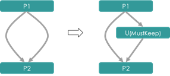

* PromotePartialProcessPass

SortedSourceAnalysis: 为每个Unit打<SortedSource> tag，内容是离自己最近的Sorted Scope所产生的Unit

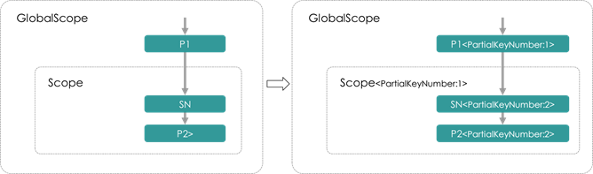

FindPartialProcessAndPromote：若一个PartialProcessNode直接上游只有1个，同时该上游处于不包含该
PartialProcessNode的SortedShuffleScope中，则可以将该PartialProcessNode前移到SortedShuffleScope内

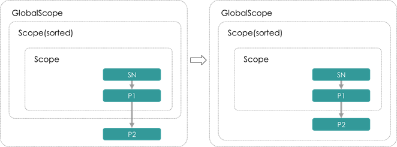

* PruneCachedPathPass

将具有<CacheReader> tag的Node进行变换：

  a. 构造一个LoadScope和LoadNode

  b. 构造一个ProcessNode对LoadNode的数据进行变换

  c. 若被Cache数据具有分组信息，则构造相应的ShuffleScope/ShuffleNode还原分组信息

  d. 若Node为ProcessNode，则将分组Key去掉

  e. 切断与上游Unit的边

  f. 添加到原下游Unit的边

* CacheAnalysis

把尚未Cache过，但Node信息中具有is_cache属性的Node打上<ShouldCache> tag，以在接下来的Pass中更新为一个Writer

* RemoveUnsinkedPass

删除掉没有下游，且不具有<HasSideEffect> tag的Unit 

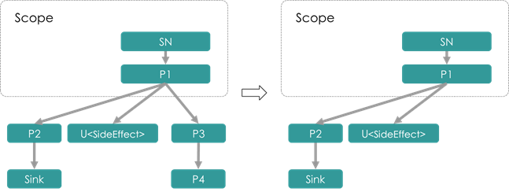

本Pass被许多Pass所依赖，进行诸如Unit前移、剪枝之后的清理工作

* RemoveUselessUnionPass

删除只有一个上游，同时不具有<MustKeep> tag的Union Node

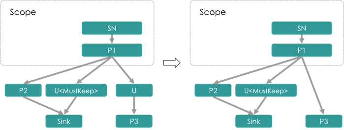

按照定义，UnionNode仅为一种虚拟节点，目的在于合并逻辑上的同构数据流，而不表示具体的执行逻辑。因此仅有
一个上游的UnionNode通常来说没有意义，可以直接删去。但当利用UnionNode处理重边时（参见SplitUnionUnitPass），
此时插入的UnionNode仅有一个上游且不能删除，这样的UnionNode被打上<MustKeep> tag

* RemoveEmptyUnitPass

删除没有孩子节点的非叶子节点

本Pass主要配合RemoveUnsinkedPass和RemoveUselessUnionPass一起，在后两者删除掉一条路径上的节点后，将被
删“空”的Unit删除

* AddDistributeByDefaultPass

查找Global Scope下的UnionNode或具有Partial边的ProcessNode，为其添加一个DistributeByDefaultScope，同时
将ProcessNode的非Partial边改为Broadcast到新添加的Scope中

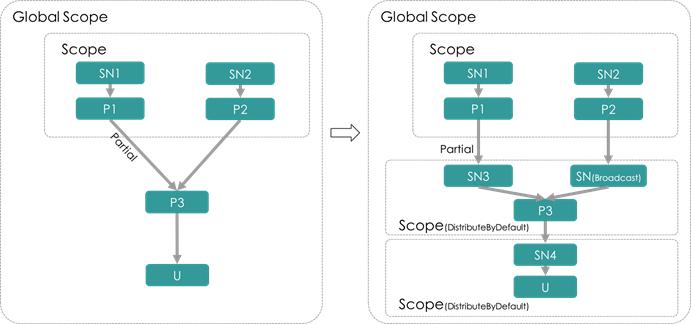

Planner策略–TopologicalOptimizing
------------------------------

* AddTaskUnitPass

Task切分：为所有GlobalScope上的节点添加一个父Unit，Unit类型为Task

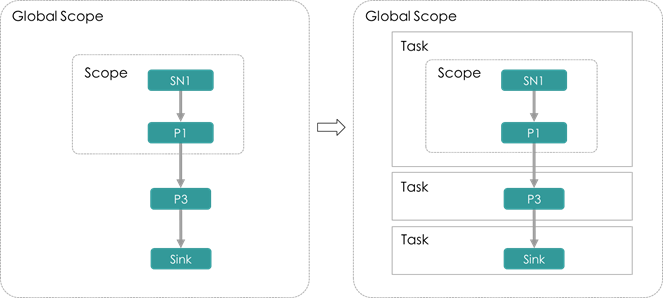

AddTaskUnitPass可以看作是逻辑计划与物理计划的分割点，Task可以是分布式作业的物理执行单元

* SetDefaultConcurrencyPass

本Pass依赖于DataFlowAnalysis

为Task设置concurrency并发量，然后尝试使用concurrency设置DistributeByDefault类型Bucket ShuffleScope的
桶数。

设置Task concurrency的原则为：

a. 若Task Unit已有TaskConcurrency标签，则使用TaskConcurrency标签值

b. 否则，若Task并非Mapper，则使用Default concurrency

为DistributeByDefault类型Bucket ShuffleScope的方式为：

a. ShuffleScope需要为其所在的Task的直接孩子，同时Task不为Mapper Task。

b. 用Task的<TaskConcurrency>标签设置设置Bucket ShuffleScope的桶数(bucket size)。同时打上<NotUserSetBucketSize>
   tag，标明桶数并非显式设置。

c. 遍历该ShuffleScope的上游Unit的Father Scope(上游ShuffleScope)，若其ID与该ShuffleScope相同，则说明上
   游ShuffleScope是由当前ShuffleScope前移产生，也对其打上<NotUserSetBucketSize> tag

* PromotePartialUnitPass

本Pass负责将位于一个Task"入口处"的Scope、ShuffleNode和PartialProcessNode前移到上一个Task中，以使得：

1. 对于Scope和ShuffleNode的移动，可以使得上一个Task能够获取Shuffle的信息，即理解Shuffle Key以及相应的
Partition等等

2. 对于PartialProcessNode的移动，可以使得计算逻辑在Shuffle过程之前进行，对于绝大多数场景，该移动可以
减少Shuffle数据的条数

Pass示意图：

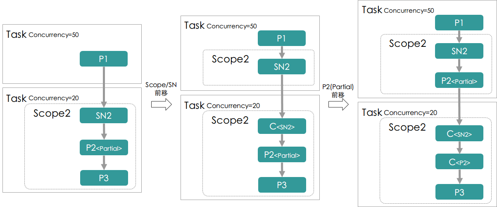

* MergeTaskPass

用于Task的合并逻辑，主要应当分两部分：

1. 将上下游Task合并，合并的规则主要有：

  a. 上下游Task有显式指定的并发值，并且相等，合并后并发值为原相等的并发值

  b. 上下游Task中，有一个没有显示指定的并发值(也就是并发量可以随意指定)，另一个有显式指定的并发值，
   则合并后的并发值为显式指定的那个

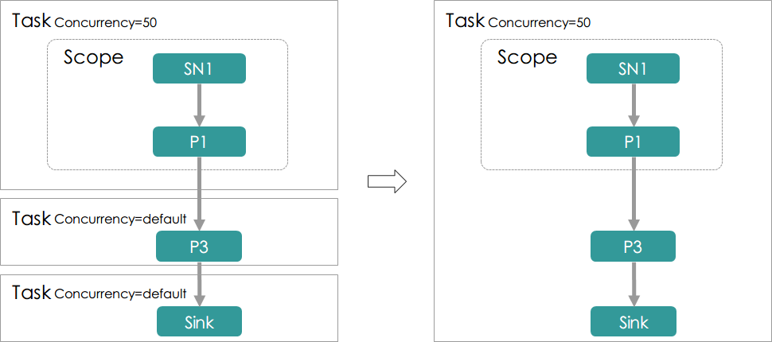

Planner翻译–RuntimeProcedure
------------------------------

* RemoveEmptyUnitPass

将一个空的非叶子Unit删除：在经过一系列的合并/删除/前移工作之后可能出现这种情况。尽管Runtime Executor
应当能够处理空Unit(什么都不做)，从性能上的考虑，本Pass很有必要

* AddCommonExecutorPass

将与计算引擎无关的非叶子Unit转换为相应的ExecutorUnit，例如，ProcessUnit转换为ProcessExecutor，为生成Pb
message做准备

* AddTransferExecutorPass

将与Spark引擎相关的非叶子Unit转换为相应的ExecutorUnit，例如，添加ShuffleInputExecutor/ShuffleOutputExecutor

Planner翻译–TranslationProcedure
---------------------------------

* BuildCommonExecutorPass

（AddCommonExecutorPass的后续工作）：为添加的CommonExecutor构建Pb message

* BuildTransferExecutorPass

（AddTransferExecutorPass的后续工作）：为添加的TransferExecutor构建Pb message

* BuildPhysicalPlanPass

（所有优化/翻译工作的最后一步）：生成总的PbSparkJob message，得到最终的物理计划

SparkRuntime
===========================================

Runtime(client):
---------------------------------

SparkBackend：

作为client执行入口，SparkBackend负责如下职能：

1. 提交一个由Pb Message描述的逻辑计划，通过SparkPlanner将其翻译为物理计划

2. 为上层的SparkPipeline维护作业的上下文状态BackendContext，其首先代理一个JVM下的SparkContext，
   通过以进程间RPC或是进程内JNI调用的方式与SparkContext通讯。同时BackendContext也负责记录Backend自身
   的状态信息，例如哪些Node被Cache/哪些路径已经被写过等

SparkJob：

SparkJob(.scala): 是通过spark-submit提交作业时指定的main class，即Spark任务的入口方法。SparkJob应当
接受用于描述物理计划的PbPhysicalPlan，将其解释为能够实际执行的Spark任务并提交给Spark执行。具体而言，
就是通过PbPhysicalPlan中的PbRDD构造出RDD，以及他们之间的lineage，构造方式如下：

a. 对于InputRDD，构造出相应的HadoopInputRDD，通过Hadoop InputFormat读取，然后使用mapPartitions方法
   调用封装了Bigflow Task的functor，由functor驱动Bigflow Runtime逻辑

b. 对于GeneralRDD，对parent RDD使用repartitionAndSortWithinPartitions进行shuffle，然后同样使用mapPartitions
  驱动Bigflow Task

对于没有下游的RDD，意味着其会有输出，将所有RDD union起来，汇集一个根RDD，根RDD没有任何数据，其作用是
驱动Spark执行编译好的RDD

最终，这样的逻辑可以通过一个接口来描述：

.. code-block:: scala

    val finalRdd = compile(pbRdds: List[PbSparkRDD])
    finalRdd.collect()

Runtime(Worker):
---------------------------------

这一部分负责在Spark平台节点上运行时，RDD与Bigflow Worker的交互模块，主要的示意图如下：

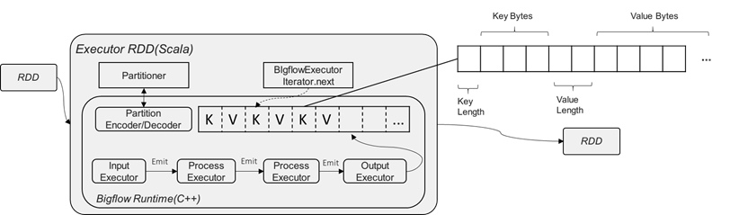

图中主要的类/模块解释：

* BigflowExecutor.iterator

BigflowExecutor封装一个C++端的BigflowTask，并使用JNI接口暴露给JVM，以使得Spark RDD运行期进行计算时
被调用。

RDD在运行时，通过一个内置的Iterator驱动数据的执行。Iterator是仅能遍历一次的迭代器，其需要实现两个抽
象方法：next()和hasNext()

Iterator是一个拉数据的模型。现有的Bigflow RuntimeDispatcher是一个推数据的模型。我们需要一个中间的Buffer
将dispatcher推数据模型转换为拉模型，其伪代码如下：

.. code-block:: cpp

    class FluneTaskRunnerIterator(input: Iterator[Any]) extends Iterator[Any] with Serializable {

        val bigflowTask = createJniTask()

        val outputBuffer: bigflowTask.getJniBuffer() // Bigflow Task的输出

        override def hasNext: Boolean = {
            if (outputBuffer.hasNext()) {
                true
            } else if (input.hasNext) {
                outputBuffer.reset()
                bigflowTask.processInput(input.next())
                hasNext
            } else if (isInputDone) {
                false
            } else {
                bigflowTask.inputDone()
                isInputDone = true
                hasNext
            }
        }
        override def next(): Any = outputBuffer.next()
    }

* BigflowTask

BigflowTask是一个Bigflow任务的对外抽象，它通过一个PbSparkTask的PbMessage构造，由SparkExecutorFactory
构造一个Bigflow ExecutorTree。通过ExecutorTree中的(Hadoop/Shuffle)InputExecutor和ShuffleOutputExecutor
提供数据输入和产出的相关接口。

除此之外，BigflowTask还负责维护所有的C++端分配的内存。

BigflowTask的对外接口应当包含：

.. code-block:: cpp

    void process_input(const StringPiece& key, const StringPiece& value)
    void input_done()
    KVBuffer* get_output_buffer()

* KVBuffer

BigflowTask的输出以K/V键值对分别序列化后的bytes数组表示，KVBuffer负责Runtime C++端的序列化后数据与JVM
的交互。具体地，申请一段内存buffer，然后依次向buffer内填充，具体的填充方式为key length, key bytes, 
value length, value_bytes。同时，KVBuffer也维护一个指针，指明当前数据读取的位置，以供JVM端根据位置取走
bytes数据

KVBuffer的对外接口应当包含：

.. code-block:: cpp

    void reset();
    void put(const toft::StringPiece& key, const toft::StringPiece& value);
    const bool has_next();
    void next();
    const char* current_pos();

Cache机制
------------

Spark有一个CacheManager作为缓存机制的抽象，它为RDD隐藏了更下层的存储机制BlockManager。CacheManager其
对外只暴露一个接口：

.. code-block:: scala

    def getOrCompute[T](
        rdd: RDD[T],
        partition: Partition,
        context: TaskContext,
        storageLevel: StorageLevel): Iterator[T]

由于Bigflow将Spark RDD看作是粗粒度的Task，因此getOrCompute并不适用。我们需要实现一个Bigflow
SparkCacheManager更细粒度地与Spark的CacheManager/BlockManager进行交互，管理cache：

* SparkCacheManager::CacheWriter:

CacheWriter自身维护一个链表/数组对缓存cache数据，通过其自身的write(key, value)将数据缓存起来，并在
writer.close()调用时构造一个Java Iterator，调用Scala下的

CacheManager.putInBlockManager进行缓存。(注意putInBlockManager是一个私有方法，需要通过反射强行调用)，
如下图所示：

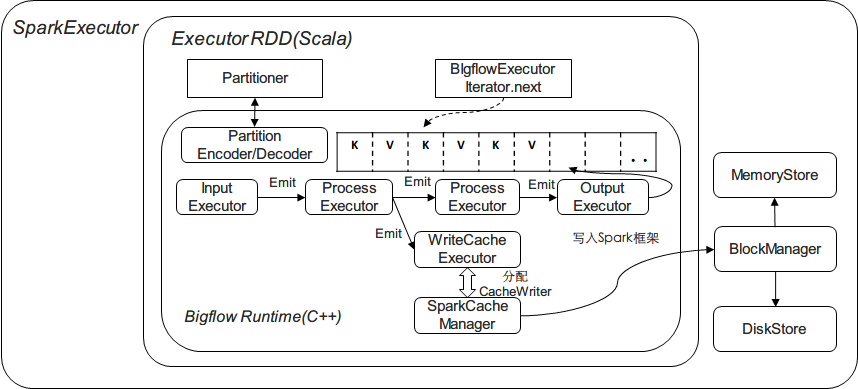

* SparkCacheManager::Reader:

BlockManager的get方法直接返回一个Some[BlockResult]，当数据已被缓存并正确读取时，可以通过BlockResult.data
拿到以Iterator表示的数据。对于Bigflow而言，可以利用其构造一个

RDD作为输入源（类似于HadoopInputRDD），如下图所示：

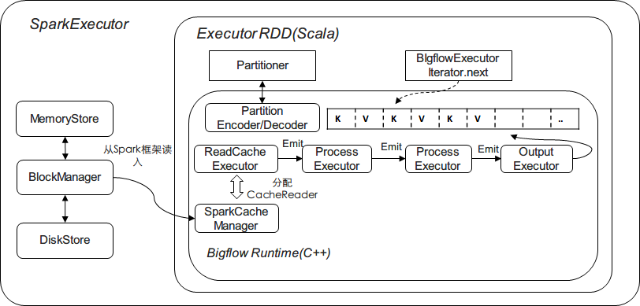

其他相关问题：构建、部署和依赖
------------------------------

由上讨论，Runtime的worker部分通过RDD内部通过JNI调用的方式来完成，其包含：

C++部分封装在一个叫做Runtime的模块里面，比如baidu.bigflow.runtime.spark.Runtime，

* 执行的入口SparkTask

* 数据交互相关模块的实现，例如OutputBuffer

* SparkExecutorFactory及所有的Executor实现

* FlumeLogService用于Debug的Log模块

* FlumeCounterService用于实现Counter的模块

这个模块要求能够以-fPic的方式编译为动态链接库在运行时被加载到JVM中通过JNI调用。例如，对于Bigflow Python，
这个链接库可以叫做libbflpyrt.so(BigflowPythonRuntime)：

* Python Interpreter不能够使用静态编译的方式构建，即Bigflow自带的Python在编译时，使用动态编译得到
  libpython.so，将其打包进前面提到的libbflpyrt.so

* Python Runtime也要替换为相应的基于libpython.so的版本

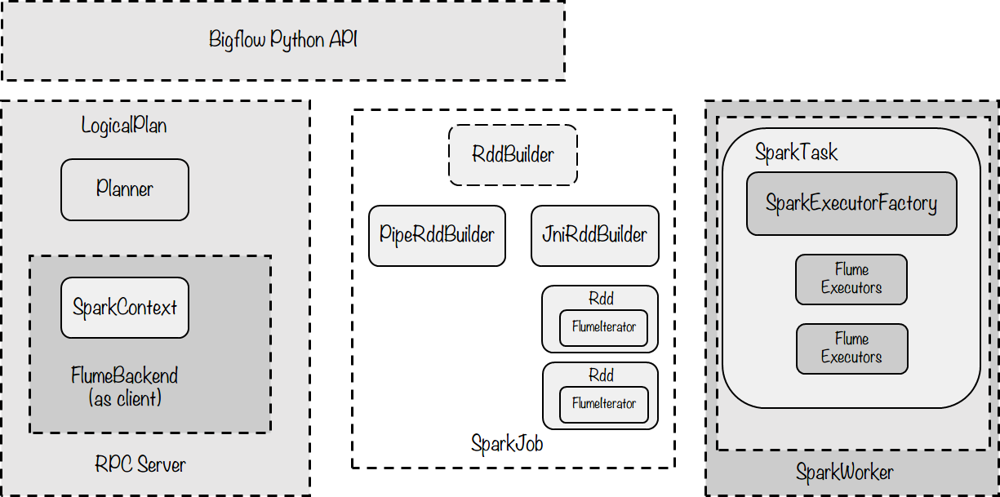

