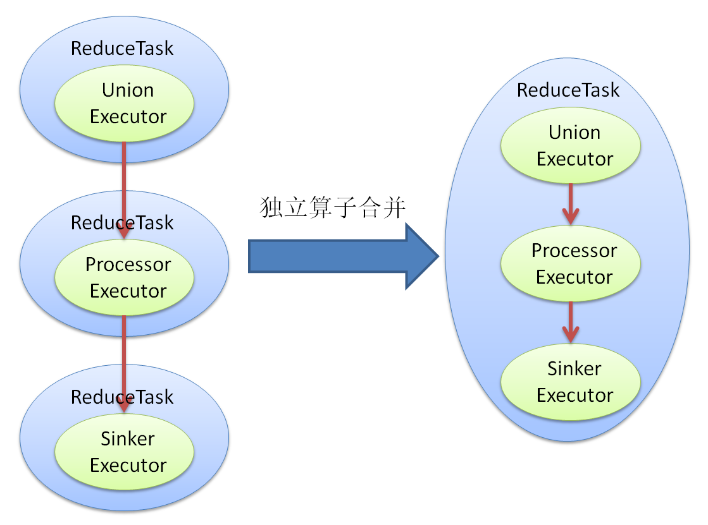
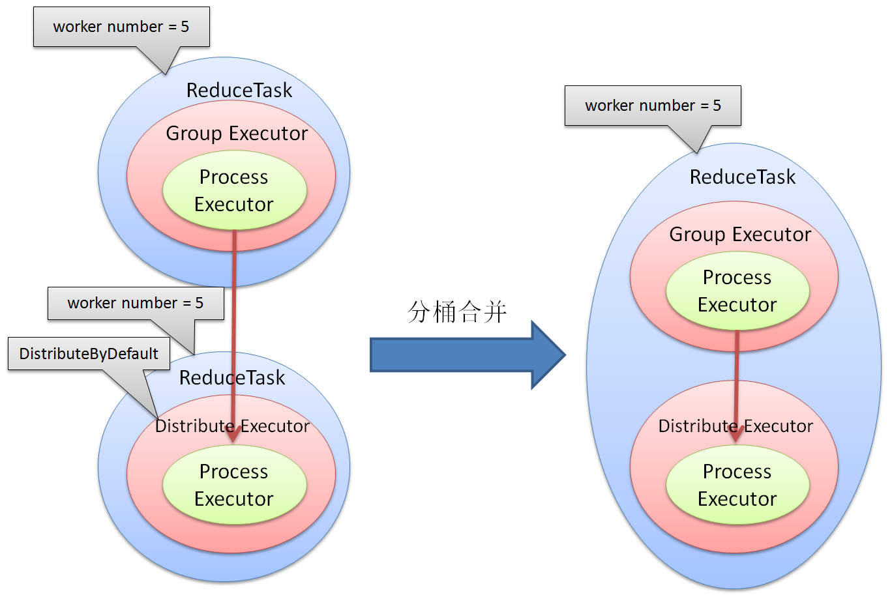
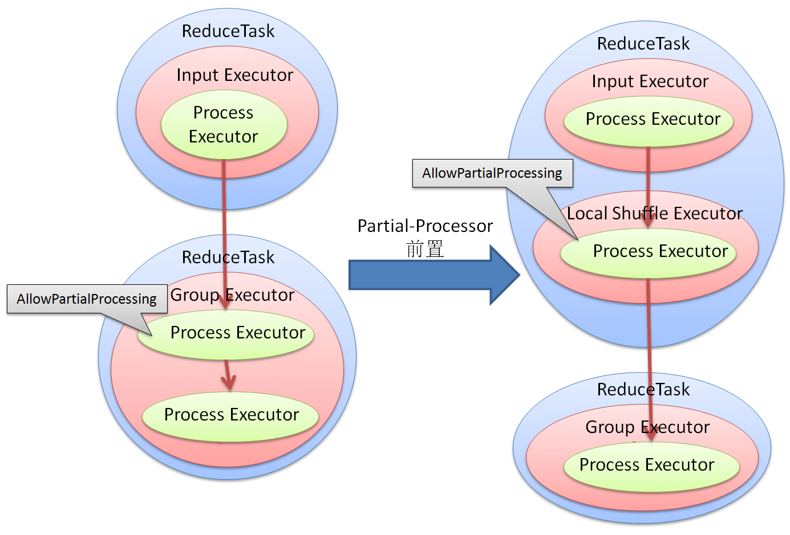

##########
优化器框架
##########

Flume的优化器框架承担两个任务, 
一是把逻辑执行计划转换为物理执行计划, 二是针对不同的backend对执行流程进行优化. 
一般来说，每个backend都有一个对应的planner作为专用的优化器. 

工作流程
========

Planner的工作流程分为三个步骤:

1. 把逻辑执行计划翻译成flume任务的中间表示层Plan
2. 在Plan上对执行流程进行优化, 包括通用优化和与backend有关的专用优化
3. 把优化结束的Plan翻译成物理执行计划

从这里可以看出, planner与Flume-Core和Flume-Runtime中的算子执行框架具有紧密的联系. 

执行计划的中间表示
==================

Plan是介于逻辑执行计划和物理执行计划之间的一种表示, 这种中间表示是一棵树, 
树的非叶子节点由Unit组成, 代表一个Executor, 
叶子节点由LeafUnit组成, 代表Executor上的一个用户算子/数据集.

所有的叶子节点之间还有一些边表示数据集之间的依赖关系, 因此Plan的描述其实是Tree + DAG.

节点之间的父子关系在Plan中称为Control, 叶子节点之间的数据依赖在Plan中称为Dependency, 
Plan提供了以下接口来修改节点之间的关系: ::

   void AddControl(Unit* father, Unit* child);
   void RemoveControl(Unit* father, Unit* child);
   void ReplaceControl(Unit* father, Unit* child, Unit* unit);

   void AddDependency(Unit* source, Unit* target, const std::string& tag);
   void RemoveDependency(Unit* source, Unit* target);
   void ReplaceDependency(Unit* source, Unit* target, Unit* unit);

Unit/LeafUnit
-------------

Unit/LeafUnit中记录了如下信息: 

* id, 仅在LeafUnit中有效, 唯一标识用户算子/数据集的输出
* type, Executor的类型, 例如DEFAULT, LOGICAL, LOCAL_SHUFFLE, EXTERNAL
* scope_level, 和Executor中的scope_level含义相同
* father, 父节点
* childs, 子节点, 包括Unit和LeafUnit
* nodes, 以当前节点为根的子树中的所有LeafUnit
* inputs, 从非nodes节点到nodes节点的所有Dependency
* outputs, 从nodes节点到非nodes节点的所有Dependency
* users, 由outputs的所有目标节点组成的集合
* needs, 由inputs的所有源节点组成的集合
* upstreams, 节点集合, 每个upstream和当前节点之间都存在一条Dependency链
* downstreams, 节点集合, 当前节点和每个downstream之间都存在一条Dependency链

优化器可以通过Unit/LeafUnit提供的接口读取以上信息

Plan
----

除了修改节点关系的接口, Plan还提供了以下方法: ::

    explict Plan(const PbLogicalPlan& message);

根据逻辑执行计划初始化Unit/LeafUnit, 并维护节点上a的信息 ::

    Unit* Root();

获取根节点, 结合Unit中的childs信息, 可以实现对Executor-Tree的遍历 ::

    Unit* NewUnit();

创建一个新的Unit节点, 返回的节点没有父节点, 也不属于任何Dependency ::

    void GetAllUnits(std::vector<Unit*>* result);

获取所有Unit/LeafUnit的集合 ::

    void GetTopologicalOrder(std::list<Unit*>* result);

以拓扑顺序获取所有LeafUnit的集合

优化框架
========

Flume-Runtime的优化框架由Pass和Dispatcher组成.

Pass
----

所有的优化都被认为是对Plan的一种变换, 即一个优化算法的输入是一个Plan, 输出也是一个Plan. 这种变换被抽象为Pass:

.. code-block:: cpp

   class Pass {
   public:
       virtual ~Pass() {}

       // return true if plan is modified
       virtual bool Run(Plan* plan) = 0;
   };

从代码层次看，planner的执行过程是通过逻辑执行计划创建Plan, 创建多个Pass对Plan进行修改, 最后生成物理执行计划. 

Dispatcher
----------

通常来说, Pass对Plan进行的变换需要按照一定的顺序对Unit/LeafUnit进行遍历, 这种遍历模型就是Dispatcher.

.. code-block:: cpp

   class Dispatcher {
   public:
       virtual ~Dispatcher() {}

       // return true if plan is modified
       virtual bool Run(Plan* plan) = 0;
   };

Dispatcher的接口和Pass是一样的, 两者的区别在于含义不同, Pass代表一个完整的优化过程, 
经过一个Pass的处理, Plan必须处于一个合理的状态, 
而一个Pass可能包括多个Dispatcher, 每个Dispatcher也可能执行多次. 

RuleDispatcher
--------------

RuleDispatcher是一个单节点遍历模型, 它把对Plan的处理拆分成对每一个节点的处理, 
对每一个节点的处理则被抽象为对这个节点使用若干Rule, 这个类定义如下: 

.. code-block:: cpp

   class RuleDispatcher {
   public:
       class Rule {
       public:
           virtual ~Rule() {}
           // return true if this Rule could Run(plan, unit)
           virtual bool Accept(const Plan* plan, const Unit* unit) = 0;
           // return true if plan is modified
           virtual bool Run(Plan* plan, Unit* unit) = 0;
       };

       virtual ~RuleDispatcher();
       virtual bool Run(Plan* plan);
       virtual void AddRule(Rule* rule);

   protected:
       virtual bool Dispatch(Plan* plan, Unit* unit);
   };

RuleDispatcher的Run方法首先从plan中获取所有Unit/LeafUnit节点, 然后对每一个节点执行Dispatch方法, 
后者尝试对这个节点应用所有注册的Rule.

RuleDispatcher对Plan的遍历是无序的, 目前扩展了两类固定顺序的RuleDispatcher: 

* DepthFirstDispatcher: 按照Plan中的Control关系深度遍历, 提供PRE_ORDER和POST_ORDER两种模式
* TopologicalDispatcher: 按照LeafUnit的Dependency关系进行拓扑遍历, 提供顺序和逆序两种模式

优化算法
========

优化算法继承Pass接口, 目前支持的优化包括独立算子合并, 分桶合并, Partial-Processor前置. 

独立算子合并
------------

global scope中的每个独立算子(Process, Union, Sink)默认会产生一轮独立的分布式计算, 
本算法将其中连续的独立算子合并到同一轮. 

分桶合并
--------

当使用分桶进行shuffle时, DistributeByDefault表明数据可以按照任意方式分成N份, 
这时数据会按照flume内置的一个算法来分桶, 但如果数据在前一轮计算中已经按照某种方式分成了N份, 
那么flume就没必要再进行一次分桶shuffle了, 本算法把这种情况下的分桶计算和前一轮计算合并.

Partial-Processor前置
---------------------

partial属性表明同一组数据可以分任意多次进行运算, 如果数据在shuffle之后进行partial运算, 
本算法可以把这次运算提前到shuffle之前, 以减少shuffle的数据量. 

